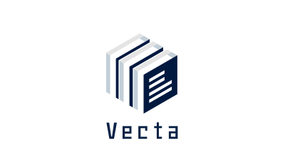

# vecta.co.jp

Vectaのコーポレートサイト。

ロゴアイコンは、「書類」などのアナログ情報を、ベクトルデータの「ブロック」へ構造化することで、世の中の知識を使いやすく整理し、誰でもアクセスできる仕組みを組み立てるというVectaのミッションを表現したものです。

## 技術スタック

- **フロントエンドフレームワーク**: [Astro.js](https://astro.build/)
- **スタイル**: CSS / CSS Modules
- **フォント**: Noto Sans JP

## 開発方法

### 必要条件

- Node.js 16.x 以上
- npm または Bun

### インストール

```bash
# 依存関係のインストール
npm install
# または
bun install
```

### 開発サーバーの起動

```bash
npm run dev
# または
bun run dev
```

開発サーバーが起動したら、ブラウザで [http://localhost:4321](http://localhost:4321) にアクセスしてください。

### ビルド

```bash
npm run build
# または
bun run build
```

ビルドされたファイルは `dist` ディレクトリに出力されます。

### プレビュー

```bash
npm run preview
# または
bun run preview
```

ビルドされたサイトをローカルでプレビューできます。

## プロジェクト構成

```
vecta.co.jp/
├── public/          # 静的ファイル
│   └── assets/      # 画像などのアセット
├── src/             # ソースコード
│   ├── assets/      # コンポーネントで使用するアセット
│   ├── components/  # Astroコンポーネント
│   ├── layouts/     # レイアウトコンポーネント
│   ├── pages/       # ページコンポーネント
│   └── styles/      # グローバルスタイル
└── ...
```

## デザインガイドライン

### カラーパレット

- ネイビー ( #0A1E3C )
  - メインカラー、テキストやアクセント
- ゴールデンオレンジ ( #E69500 )
  - 強調要素、CTAボタンなど
  - 視認性：◎（白背景：良好、黒背景：映える）
  - コントラスト（白背景）: 約 4.5:1（AA基準クリア）
- 墨色 (#2F2F2F) - 見出し、ボディテキスト

### レスポンシブブレイクポイント

- 480px: モバイル（小）
- 481px: モバイル（大）
- 600px: タブレット（小）  
- 768px: タブレット（中）
- 769px: タブレット（大）
- 1024px: デスクトップ
- 1280px: ワイドスクリーン

これらのブレイクポイントは `src/styles/scss/_breakpoints.scss` でSass変数として定義されており、各コンポーネントでインポートして使用します。

### フォント

- 見出し: Noto Sans JP (Bold)
- 本文: Noto Sans JP (Regular)

## ライセンス

All rights reserved © Vecta
